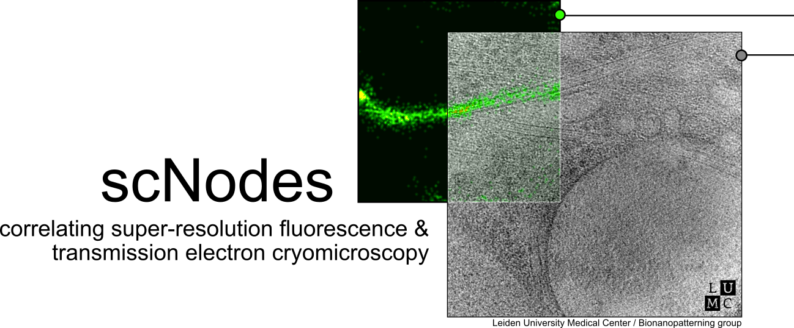
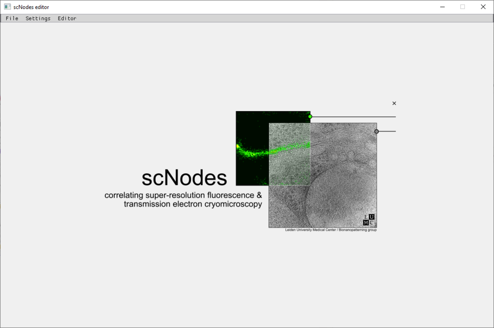
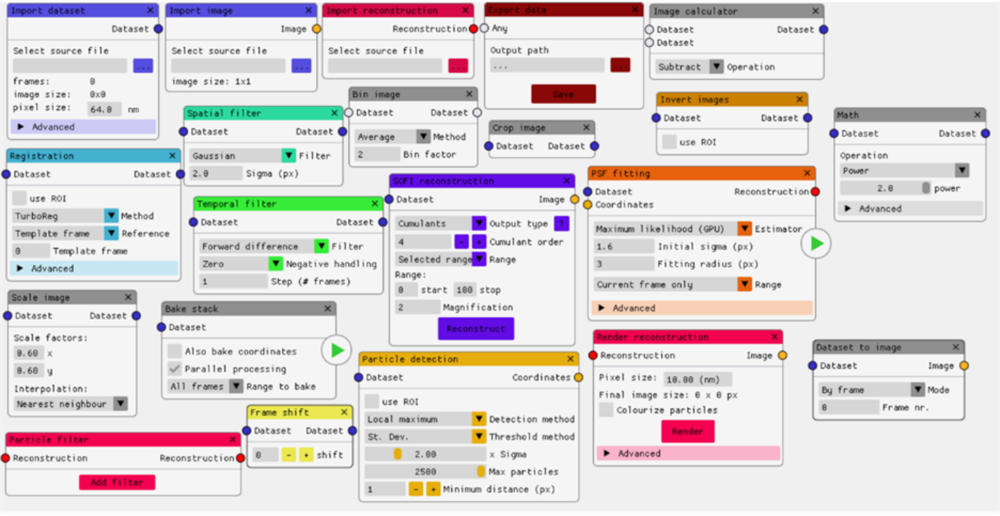
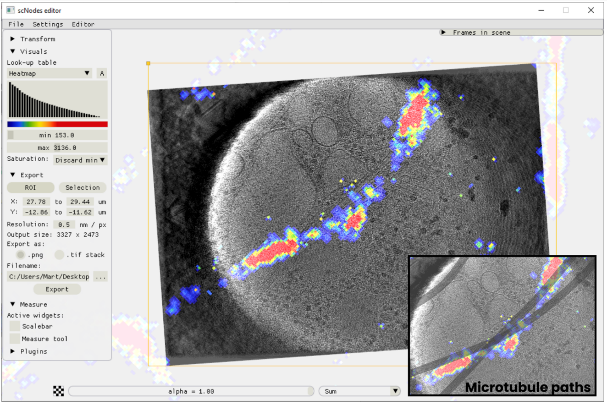
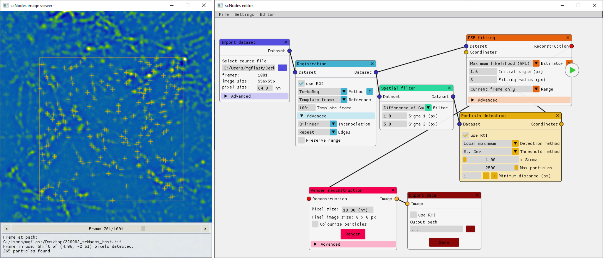
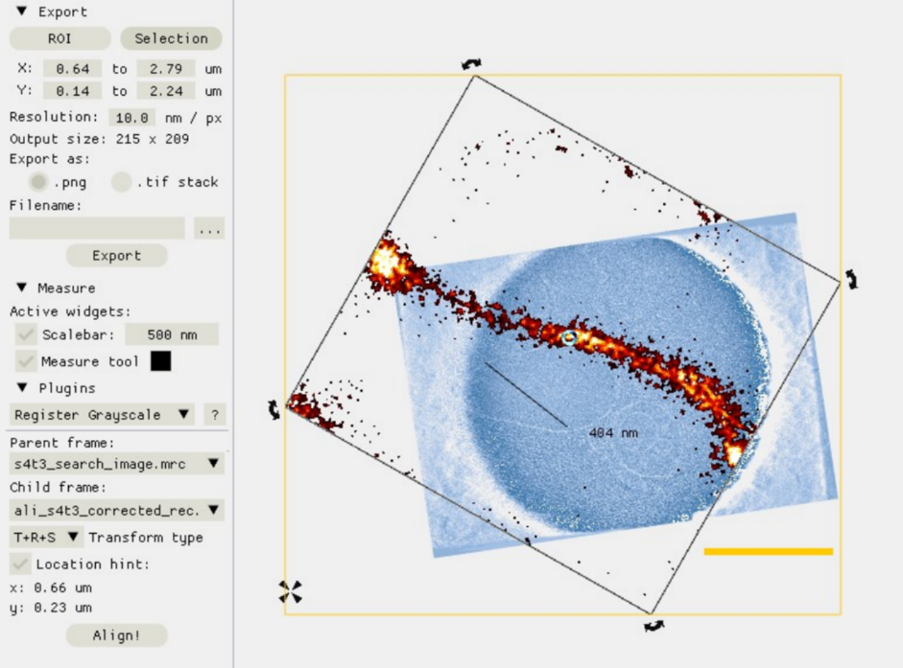

### scNodes: correlating super-resolution fluorescence & transmission electron cryomicroscopy

#### About
scNodes is multiple things: i) software for super-resolution fluorescence microscopy data processing, ii) software for correlation of multi-modal microscopy, such as fluorescence & electron microscopy, but mainly iii) **a software suite for correlated super-resolution fluorescence and transmission electron cryomicroscopy.** 

We designed this programme for use in our own ‘super-res-cryo-CLEM’ workflow – but the full final programme may also find use outside of this field. scNodes consists of two main parts: the Node Editor, for fluorescence microscopy image processing, and the Correlation Editor, for correlation of images. 

While the first public release of scNodes comprises a fully functional programme, there are numerous features, processing modules, or correlation methods that one could think of to improve the software with.  For this reason, **scNodes was designed to be easily extensible.** This manual includes a tutorial on creating custom nodes for the Node Editor, as well as on how to create plugins for the Correlation Editor. Rather than by creating your own features, installing extra features is another way of extending the core functionality of scNodes. The  GitHub repository for this project (github.com/bionanopatterning/scnodes) contains a discussions section where, it is our hope, you will share and find such plugins. This discussion board is also a place to ask for help. We hope that others will also find this software useful.

#### Installation
Instructions on how to install and use scNodes can be found in the manual: 'scNodes_manual.pdf'. For help, visit the Discussions board. Inquiries: m.g.f.last@lumc.nl

### Gallery
___
#### scNodes home screen

___
#### Overview of default nodes in the Node Editor

___
#### Correlating super-resolution fluorescence with cryo-electron tomography in the Correlation Editor

___
#### Super-resolution fluorescence reconstruction in the Node Editor

___
#### Editing tools in the Correlation Editor
