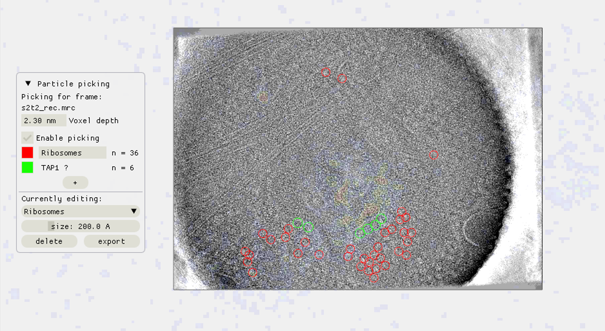

### scNodes: correlating super-resolution fluorescence & transmission electron cryomicroscopy

#### About
scNodes is a software suite for correlated super-resolution fluorescence and cryoEM (SR-cryoCLEM). We designed the program for use in our own SR-cryoCLEM workflow, but we anticipate that scNodes as a whole or parts of the software may 
also find use outside this field. 
scNodes consists of two main parts: the Node Editor, for fluorescence microscopy image 
processing, and the Correlation Editor, for correlation of images. This manual consists of two 
corresponding parts: an introduction to the Node Editor, in which we demonstrate how to 
create super-resolution reconstructions with scNodes, and an introduction to the 
Correlation Editor that outlines a method to correlate super-resolution data with cryo-electron tomograms. 
While the first public release of scNodes comprises a fully functional program, there are 
numerous features, processing modules, or correlation methods that one could think of to 
improve the software. For this reason, scNodes was designed to be extensible. This manual 
includes a tutorial on creating custom nodes for the Node Editor, as well as on how to 
create plugins for the Correlation Editor. Rather than by creating your own features, 
installing extra features is another way of extending the core functionality of scNodes. The 
GitHub repository for this project (github.com/bionanopatterning/scnodes) contains a 
discussions section where, it is our hope, you can share or find such plugins. This board is 
also a place to ask for help. We hope that others will also find our software of use, and that 
if so they provide feedback or share their plugins on this forum.  

We designed this programme for use in our own ‘correlated super-resolution fluorescence and electron cryo-microscopy’ workflow – but the full final programme may also find use outside of this field. scNodes consists of two main parts: the Node Editor, for fluorescence microscopy image processing, and the Correlation Editor, for correlation of images. 

While the first public release of scNodes comprises a fully functional programme, there are numerous features, processing modules, or correlation methods that one could think of to improve the software with.  For this reason, **scNodes was designed to be easily extensible.** This manual includes a tutorial on creating custom nodes for the Node Editor, as well as on how to create plugins for the Correlation Editor. Rather than by creating your own features, installing extra features is another way of extending the core functionality of scNodes. The  GitHub repository for this project (github.com/bionanopatterning/scnodes) contains a discussions section where, it is our hope, you will share and find such plugins. This discussion board is also a place to ask for help. We hope that others will also find this software useful.

#### Installation
Instructions on how to install and use scNodes can be found in the manual: 'scNodes_manual.pdf'. For help, visit the Discussions board. Inquiries: m.g.f.last@lumc.nl

### Gallery
___
#### scNodes home screen

___
#### Overview of default nodes in the Node Editor

___
#### Correlating super-resolution fluorescence with cryo-electron tomography in the Correlation Editor

___
#### Super-resolution fluorescence reconstruction in the Node Editor

___
#### Editing tools in the Correlation Editor

___
#### Fluorescence-guided particle picking

